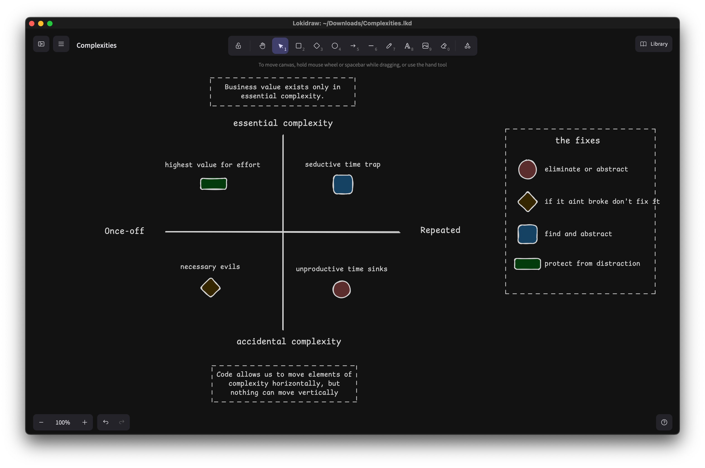
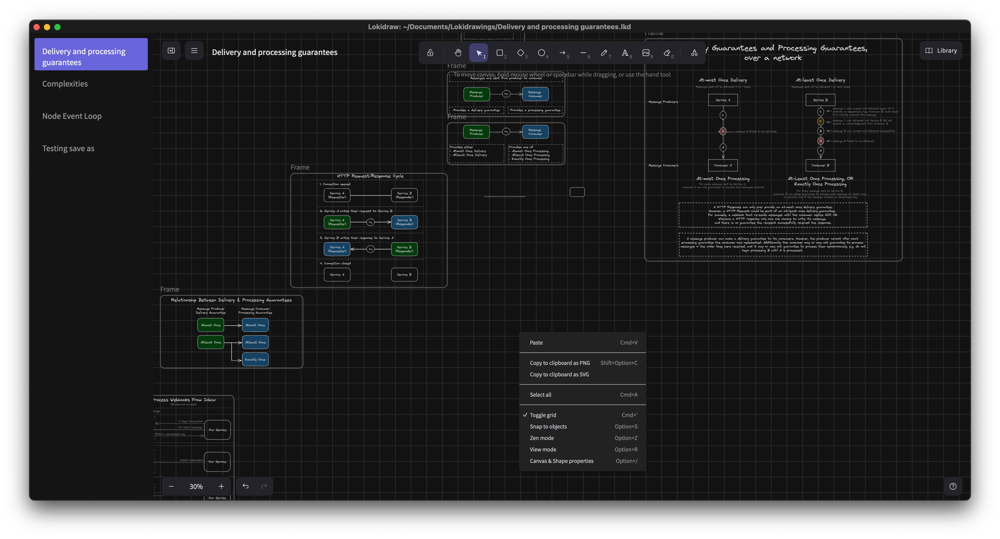

# Lokidraw: Desktop Excalidraw

Lokidraw is a desktop application wrapper around open-source virtual whiteboard library, [Excalidraw](https://github.com/excalidraw/excalidraw).



## Why?

Partly I built Lokidraw for fun, and partly to keep drawings for personal projects, like this one, from cluttering my work account. I also wanted to save drawings in an organized local file structure, while still having a recents sidedraw like the paid team Excalidraw:



Turns out, it also provides an incredibly fast and snappy user experience!

## Installation

**Macos:** Download and install from the latest `.dmg` file in [Releases](https://github.com/Antman261/lokidraw/releases)


**Windows & Linux:** 

```
git clone https://github.com/Antman261/lokidraw.git

cd lokidraw

deno task tauri build
```

*Lokidraw is currently untested on operating systems other than macos!* I don't know if the above will build successfully on Windows or Linux. There's also likely quite a bit of code that needs to be adjusted for cross-platform support. Contributions welcome!

## Contributing

Lokidraw is built using:

* [Tauri](https://v2.tauri.app)
* [Preact](https://preactjs.com)
* [Vite](https://vite.dev)
* [Deno](https://deno.com) (basically used as a glorified package manager in this project)

### Recommended IDE Setup

- [VS Code](https://code.visualstudio.com/) + [Tauri](https://marketplace.visualstudio.com/items?itemName=tauri-apps.tauri-vscode) + [rust-analyzer](https://marketplace.visualstudio.com/items?itemName=rust-lang.rust-analyzer)
